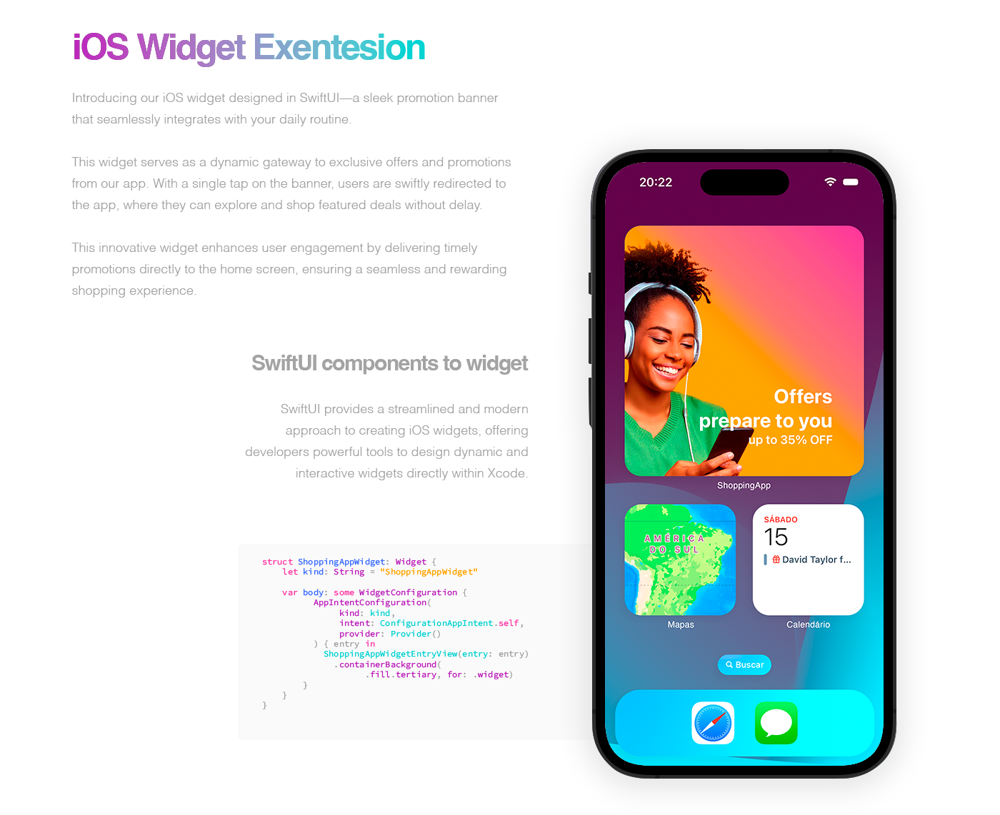

<h1 align="center" style="font-weight: bold;">
Shopping App iOS 
</h1>

 <a href="#about">About</a> • 
 <a href="#tech">Technologies</a> • 
  <a href="#run">Requirements</a> •
 <a href="#license">License</a>

<h2 id="about"> About the App 💻 </h2>

Welcome to Shopping App iOS, a sample shopping app built to study SwiftUI and iOS development. This project utilizes the native iOS development stack and is implemented using Swift and SwiftUI.

Develop by @marialuisacp.

<h3 id="started"> Overview </h3>

Shopping App iOS fetches product data from the [Fake Store API](https://fakestoreapi.com/), providing a list of products, filtering options, and detailed information about each product. It aims to showcase the usage of SwiftUI for building modern and intuitive user interfaces in iOS apps.

<h3 id="features"> Features </h3>

- Fetches product data from the Fake Store API
- Displays a list of products with images, titles, prices, and categories
- Supports filtering products by category
- Provides detailed information about each product, including description, price, and image

<h2 id="tech"> Technologies </h2>

The main technologies used in this project are:
- Swift
- SwiftUI
- URLSession
- CoreData
- React Native Module

In this project, SwiftUI was employed to design native components and screens for iOS, encompassing all primary interfaces. 

<h3 id="resources"> Other Native Resources </h3>

Alongside visual development, the app interacts with the store through requests to fetch products and product categories, facilitated by URLSession. 

Persistence of shopping cart data is achieved using CoreData, ensuring seamless management and retention of user selections within the application.

<h3 id="wdget"> iOS Widget Exentesion </h3>

Introducing our iOS widget designed in SwiftUI—a sleek promotion banner that seamlessly integrates with your daily routine.

This widget serves as a dynamic gateway to exclusive offers and promotions from our app. With a single tap on the banner, users are swiftly redirected to the app, where they can explore and shop featured deals without delay.

This innovative widget enhances user engagement by delivering timely promotions directly to the home screen, ensuring a seamless and rewarding shopping experience.

<h2 id="module"> React Native Module </h2>

To explore the integration of React Native modules into the app, we developed an RN module that is accessible in [this repository](https://github.com/marialuisacp/shopping-app-module-rn).

The module was integrated using RCTView in Swift, incorporating React Native libraries into the project. Additionally, a Bridge Manager was implemented to facilitate seamless communication between the native and React Native environments.

<h2 id="run"> Run </h2>

<h3 id="requirements"> Requirements </h3>

- Xcode 12 or later
- Swift 5.0 or later
- Internet connection to fetch data from the Fake Store API

<h3 id="install"> Installation </h3>

1. Clone or download the repository.
2. Open the project in Xcode.
3. Build and run the project on a simulator or a physical device.

<h3 id="usage"> Usage </h3>

Upon launching the app, you will be presented with a list of products. You can tap on any product to view its details. The app also allows you to filter products by category using the provided filter options.

<h2 id="credits"> Credits </h2>

- Fake Store API: [https://fakestoreapi.com/](https://fakestoreapi.com/)
- SwiftUI: [https://developer.apple.com/xcode/swiftui/](https://developer.apple.com/xcode/swiftui/)

<h2 id="license"> License </h2>

This project is licensed under the [MIT License](LICENSE). Feel free to use and modify the code as per your requirements.