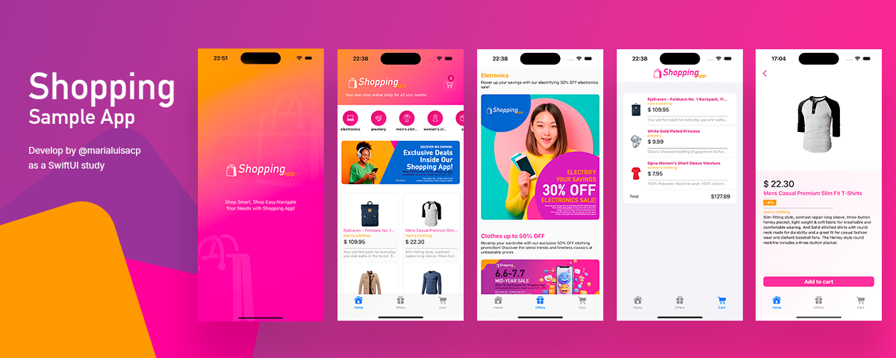

# Shopping App iOS

Welcome to Shopping App iOS, a sample shopping app built to study SwiftUI and iOS development. This project utilizes the native iOS development stack and is implemented using Swift and SwiftUI.

Develop by @marialuisacp.

## Overview

Shopping App iOS fetches product data from the [Fake Store API](https://fakestoreapi.com/), providing a list of products, filtering options, and detailed information about each product. It aims to showcase the usage of SwiftUI for building modern and intuitive user interfaces in iOS apps.

## Features

- Fetches product data from the Fake Store API
- Displays a list of products with images, titles, prices, and categories
- Supports filtering products by category
- Provides detailed information about each product, including description, price, and image

## Technologies

- Swift
- SwiftUI
- URLSession

## Requirements

- Xcode 12 or later
- Swift 5.0 or later
- Internet connection to fetch data from the Fake Store API

## Installation

1. Clone or download the repository.
2. Open the project in Xcode.
3. Build and run the project on a simulator or a physical device.

## Usage

Upon launching the app, you will be presented with a list of products. You can tap on any product to view its details. The app also allows you to filter products by category using the provided filter options.

## Credits

- Fake Store API: [https://fakestoreapi.com/](https://fakestoreapi.com/)
- SwiftUI: [https://developer.apple.com/xcode/swiftui/](https://developer.apple.com/xcode/swiftui/)

## Contributing

Contributions are welcome! If you find any issues or have suggestions for improvements, please feel free to open an issue or submit a pull request.

## License

This project is licensed under the [MIT License](LICENSE). Feel free to use and modify the code as per your requirements.